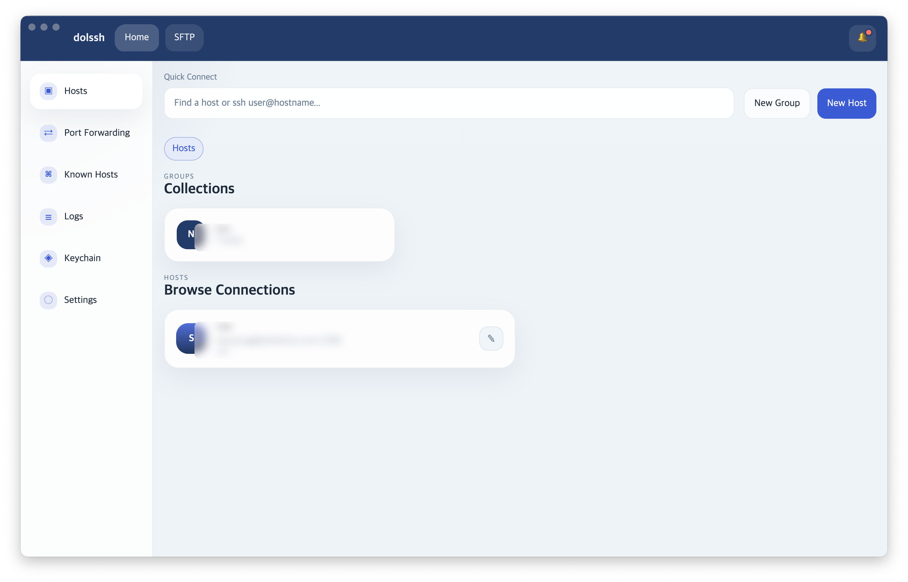

# dolssh

dolssh는 macOS와 Windows를 위한 크로스 플랫폼 SSH 클라이언트입니다.  
멀티 세션 터미널, SFTP 파일 브라우저, 포트 포워딩, known hosts 검증, 브라우저 로그인 기반 계정 동기화까지 하나의 데스크톱 앱으로 묶는 것을 목표로 합니다.

## 주요 기능

- xterm.js 기반 SSH 터미널과 다중 세션 탭
- 탭 드래그 기반 세션 Workspace 분할 보기
- 고정 `SFTP` 탭과 듀얼 패널 파일 브라우저
- Local/Remote, Remote/Remote 파일 전송과 진행률 표시
- 그룹/호스트/secret 관리
- Known Hosts TOFU 검증과 관리 화면
- Local / Remote / Dynamic 포트 포워딩
- 브라우저 로그인 기반 계정 인증과 서버 동기화
- 전역 터미널 테마, 폰트, 글자 크기 설정
- host별 터미널 테마 override
- GitHub Releases 기반 데스크톱 배포와 업데이트 확인

## 스크린샷

### 홈 화면

호스트, 그룹, 포트 포워딩, known hosts, logs, keychain, settings를 한 화면에서 관리할 수 있습니다.



추가로 나중에 함께 넣으면 좋은 화면:

- 분할된 SSH Workspace
- 듀얼 패널 SFTP 파일 브라우저
- Terminal 설정과 테마 preset 선택 화면

## 현재 제품 범위

지금 구현된 dolssh는 다음 흐름을 중심으로 동작합니다.

- 앱 실행 후 refresh token으로 세션 복구 시도
- 실패 시 로그인 게이트 표시
- 외부 브라우저에서 `login / signup / optional OIDC SSO`
- 로그인 성공 후 `groups`, `hosts`, `secrets`, `known_hosts`, `port_forwards`, `preferences` 동기화
- 이후 홈, SSH 세션, SFTP, 포트 포워딩, 설정 화면 사용

즉, 어느 PC에서든 로그인만 하면 기존 호스트와 터미널 설정을 복원하는 방향으로 설계되어 있습니다.

## 아키텍처 한눈에 보기

dolssh는 세 런타임 경계로 구성됩니다.

1. `apps/desktop`
   Electron + React 기반 데스크톱 앱  
   UI, 로컬 파일 저장소, encrypted local store, 브라우저 로그인, sync, 업데이트를 담당합니다.

2. `services/ssh-core`
   Go 기반 SSH 런타임 프로세스  
   SSH 세션, SFTP, 포트 포워딩, 파일 전송을 담당합니다.

3. `services/sync-api`
   Go + Gin + GORM 기반 인증/동기화 서버  
   로그인, refresh, sync, encrypted payload 저장을 담당합니다.

자세한 구조는 아래 문서를 참고하세요.

- [아키텍처 문서](./docs/architecture.md)
- [빌드 및 배포 가이드](./docs/build-and-deploy.md)

## 로컬 개발 시작

### 요구 사항

- Node.js 24+
- npm 11+
- Go 1.25+

### 설치

```bash
npm install
(cd services/ssh-core && go mod tidy)
(cd services/sync-api && go mod tidy)
```

### 실행

데스크톱 앱만 실행:

```bash
npm run dev:desktop
```

sync API만 실행:

```bash
npm run dev:api
```

로그인 + 동기화까지 포함한 전체 흐름:

```bash
npm run dev
```

## 로그인과 동기화

- 데스크톱 앱은 시작 시 refresh token으로 자동 로그인 복구를 먼저 시도합니다.
- 복구에 실패하면 앱 전체가 로그인 게이트로 전환됩니다.
- 로그인은 backend `/login` 페이지를 외부 브라우저로 열어 처리합니다.
- local 로그인 폼은 기본으로 제공하고, OIDC가 켜져 있으면 SSO 버튼이 추가됩니다.
- 로그인 성공 후 서버 동기화가 끝나야 실제 workspace가 열립니다.

동기화 대상:

- `groups`
- `hosts`
- `secrets`
- `known_hosts`
- `port_forwards`
- `preferences`

로컬 전용 항목:

- 앱 외형 테마(`system / light / dark`)
- 활동 로그
- 일부 업데이트 상태
- 터미널 폰트 / 글자 크기

## 터미널 설정

SSH 터미널은 앱 외형 테마와 별도로 독립 설정을 가집니다.

- 전역 터미널 테마: 동기화됨
- host별 터미널 테마 override: 동기화됨
- 터미널 폰트 / 글자 크기: 현재 기기에서만 유지

즉, 다른 기기에서 로그인하면 전역/host별 터미널 색상은 복원되지만, 폰트와 글자 크기는 각 기기 설정을 따릅니다.

## 로컬 저장 방식

데스크톱 앱은 네이티브 SQLite 모듈 없이 파일 기반 저장소를 사용합니다.

- 로컬 상태 파일: `app.getPath('userData')/storage/state.json`
- 로그 파일: `app.getPath('userData')/storage/activity-log.jsonl`
- secret / refresh token 캐시: Electron `safeStorage` 기반 encrypted local store

서버 동기화가 기준(source of truth)이고, 로컬 저장소는 캐시와 런타임 상태 보존용입니다.

## 설정 파일

### 데스크톱 앱

Git에 올라가는 예시 파일:

- `apps/desktop/config/development.example.json`
- `apps/desktop/config/desktop.example.json`

실제 파일:

- `apps/desktop/config/development.json`
- `apps/desktop/config/desktop.json`

사용자 override:

- macOS 기준 `~/Library/Application Support/dolssh/desktop-config.json`

가장 중요한 값은 `sync.serverUrl`입니다.

### sync API

Git에 올라가는 예시 파일:

- `services/sync-api/config/default.example.json`
- `services/sync-api/config/production.example.json`
- `services/sync-api/config/production.mysql.example.json`

실제 파일:

- `services/sync-api/config/default.json`
- 또는 `DOLSSH_API_CONFIG_PATH=/absolute/path/to/config.json`

정책:

- Git에는 `*.example.json`만 올립니다.
- 실제 운영값이 들어간 `*.json`은 `.gitignore`로 제외합니다.
- 실제 파일이 없으면 예시 파일을 fallback으로 읽습니다.

## sync API Docker 배포

`sync-api`는 Docker로 독립 배포할 수 있습니다.

SQLite 기준:

```bash
cp services/sync-api/config/production.example.json services/sync-api/config/production.json
mkdir -p services/sync-api/data
cd services/sync-api/deploy
cp docker-compose.example.yml docker-compose.yml
docker compose up -d --build
```

MySQL 기준:

```bash
cp services/sync-api/config/production.mysql.example.json services/sync-api/config/production.json
mkdir -p services/sync-api/data/mysql
cd services/sync-api/deploy
cp docker-compose.mysql.example.yml docker-compose.yml
docker compose up -d --build
```

참고:

- Docker 이미지는 `services/sync-api/Dockerfile`을 사용합니다.
- MySQL DSN의 `mysql:3306`은 Docker Compose 내부 서비스명일 때만 동작합니다.
- reverse proxy 예시는 `services/sync-api/deploy/nginx.sync-api.example.conf`를 참고하세요.

## 릴리즈 빌드

로컬 아티팩트만 생성:

```bash
npm run release:dist:mac
npm run release:dist:win
```

주의:

- `node-pty` 같은 네이티브 Electron 런타임 의존성이 포함되므로, 대상 플랫폼용 릴리즈는 해당 플랫폼 환경에서 의존성을 설치/재빌드한 뒤 패키징하는 것을 권장합니다.

GitHub Release 업로드까지 수행:

```bash
npm run release:mac
npm run release:win
npm run release:all
```

업로드 흐름:

1. GitHub Device Flow 브라우저 로그인
2. `ssh-core` 타깃 플랫폼 빌드
3. Electron Forge prepackaged 앱 생성
4. electron-builder로 배포 아티팩트 생성
5. GitHub Release `doldolma/dolssh` 생성 또는 갱신
6. asset 및 업데이트 메타데이터 업로드

참고:

- GitHub OAuth App의 `client_id`는 `apps/desktop/scripts/github-oauth-config.cjs`에 설정합니다.
- macOS 자동 업데이트는 서명되지 않은 앱에서는 다운로드 후 적용이 실패할 수 있습니다.
- Windows 설치 프로그램은 `current user` 전용 `one-click` NSIS 방식으로 배포됩니다.
- `release:dist:*`는 로컬 빌드만 수행하고 업로드하지 않습니다.

## 보안 기본값

- renderer는 Node 권한에 직접 접근하지 않습니다.
- 호스트 자격 증명과 refresh token은 Electron `safeStorage` 기반 encrypted local store에 캐시됩니다.
- 서버에는 plaintext secret 대신 암호화된 payload만 저장합니다.
- refresh token은 해시만 저장합니다.
- refresh token은 미사용 14일 만료(sliding idle expiration) 정책을 사용합니다.
- 운영 환경에서는 반드시 HTTPS 뒤에서 sync API를 구동해야 합니다.

## 테스트와 검증

```bash
npm run test:fast
```

테스트 층:

- `fast`: 외부 네트워크나 실제 AWS/SSH 없이 돌아가는 단위 테스트와 경량 통합 테스트입니다. 개발 중 기본 회귀 체크로 사용합니다.
- `smoke`: Electron 앱을 실제로 띄워 로그인 게이트, 홈 섹션 전환, 가짜 AWS 세션 탭 생성, SFTP 기본 렌더링까지 확인합니다.
- `manual`: Windows SSM 실제 입력, 실제 SSH/SFTP 연결, 릴리즈 빌드 실행, 업데이트 경로처럼 OS/외부 환경 의존 시나리오는 수동 체크리스트로 검증합니다.

주요 명령:

```bash
npm run test:fast
npm run test:desktop
npm run test:desktop:main
npm run test:desktop:renderer
npm run test:services
npm run test:ssh-core
npm run test:sync-api
npm run test:smoke
npm run test:all
npm run typecheck --workspace @dolssh/desktop
```

수동 체크리스트를 권장하는 경우:

- Windows에서 AWS SSM 연결 후 일반 문자, Enter, 화살표 키, Backspace, Tab, Ctrl+C 입력 확인
- 실제 SSH 터미널 연결과 known_hosts / credential retry 흐름 확인
- 실제 SFTP 연결과 업로드/다운로드/충돌 처리 확인
- 패키징된 macOS/Windows 앱 실행과 업데이트 확인

원칙:

- 기본 자동 테스트는 외부 네트워크, 실제 AWS 계정, 실제 SSH 서버를 요구하지 않도록 유지합니다.
- `test:smoke`는 opt-in 로컬 검증으로 두고 기본 `npm test`에는 포함하지 않습니다.
- 기능 수정이나 버그 수정 시에는 관련 모듈 테스트를 함께 추가하는 흐름을 기본으로 합니다.
```

## 문서

- [아키텍처 문서](./docs/architecture.md)
- [빌드 및 배포 가이드](./docs/build-and-deploy.md)
